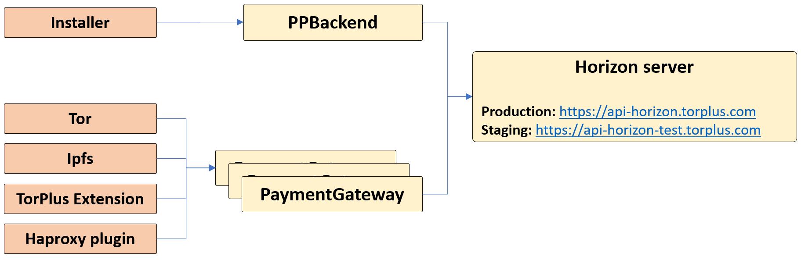

# TorPlus Stellar integration

TorPlus's native tokens - `TorPlusTokens` (`TPT`) - are implemented as Stellar `assets`. All (micro)payments in the TorPlus ecosystem utilize `TPT`. `TPT` can be exchanged to/from Stellar's native token - XLM (Lumen) - via the decentralized exchange (DEX) mechanisms built into Stellar.
Stellar native currency is XLM (Lumens) and XLM balance is required for every live account.
Besides transaction fees, positive balance is required for keeping the account above minimum permissible balance, which is 2 XLM (1 XLM for account minimum + 1 XLM for `TPT` trust line).

All TorPlus software modules require connectivity to Stellar network, usually done through PaymentGateway module. PaymentGateway, in turn, connects directly to Stellar using one of the available Horizon servers.
Since standard Horizon API is used, public horizon server can be used (https://horizon.stellar.org/) , or TorPlus dedicated server, as listed in the diagram below.

Accounts are at the heart of the Stellar network. Accounts hold a balance in XLM, `torplus_token` or any other valid Stellar asset. An account consists of a Account ID (public key) and a *secret* (private) key. The Account ID is public: anyone can pay to the account, while the secret key is ... secret. Knowing the secret key is required for paying _by_ this account. For example, `SB66SLUNMNW4CP3JDZV2OUGPEELDNWQTVN6ZM2RRWKTZ3F2VG64JK5SR` is a secret key and `GDEAZKI6RFHTVJ5SG7HUZYIQKBUIEVRJOG75XODHXJUEYKTNEHO5P3A2` is its (public) account ID. Needless to say (but we'll say it anyway) **keep your secret keys secret**.

To use a stellar account with TorPlus it needs to be able to make and accept payments in TorPlus currency - `TPT` assets.
A stellar asset is defined using two parameters, asset code and issuer.
For `TorPlusToken` asset the code is `TPT` and the issuer address is "GDTY7EETPKH2EY3NDNB3AZO2KTOSLSNHH7E3VM6C6B523J3Q5ZLLNK46".
Once you set up `TPT` currency for your account (Called setting up a trust line), you can receive and make payments in `TPT` currency.

If you feel comfortable with Stellar, you can make the necessary changes to your account yourself, but if not - you can use helper scripts.
To use the helper scripts, clone the following repo: https://github.com/torplusdev/torplus_tools
Providers folder requires the scripts needed to set up account for a TorPlus service provider.

Since Stellar accounts have minimum balance (in native XLM currency), you will need an account that will be able to fund (transfer at least 2 XLM) to your new account.
You should have the funding account seed available for the next operation.

To create a new account that you can use for TorPlus, call *create_and_fund.py* passing the funding account seed as a parameter.
It will output the seed and address for the newly created account. 
***Make sure to save this information, it will not be shown again and will void the account - if lost.***

Next, run *setup_account.py*, passing the seed of the new account (printed by the previous operation). setup_account will set up the trustline for the `TPT` currency.

If you wish to test that everything was set up correctly, you can run *validate.py* passing your account *address* as a parameter.

***Note:*** If you already own a Stellar account, and you wish to use it as-is for TorPlus - you can skip creation of a new account and just run setup_account with the existing account seed.
We recommend creating a separate account for using with TorPlus, even if you feel comfortable with Stellar and already have one or more Stellar accounts.

