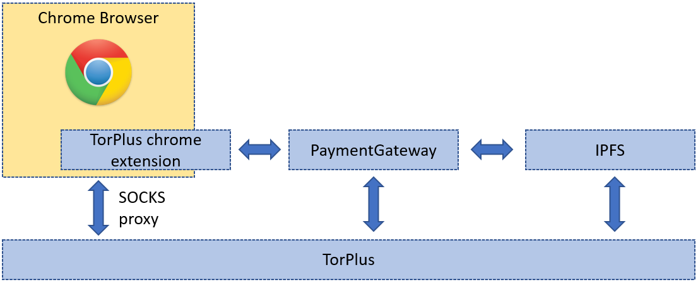
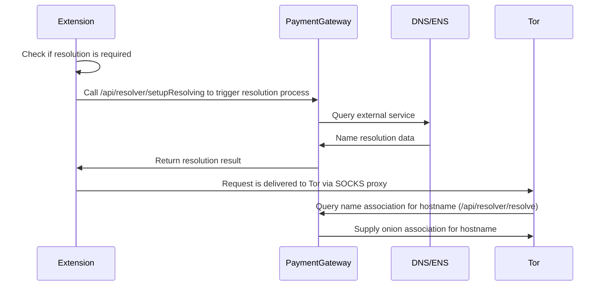
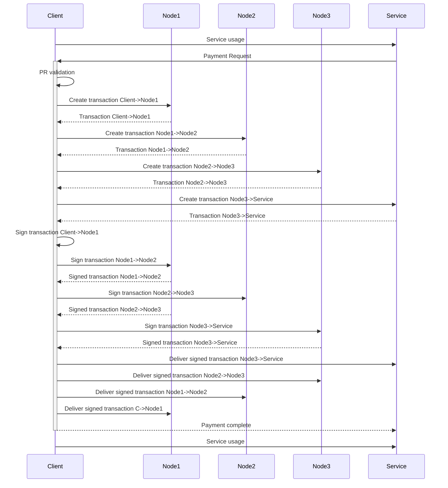

**Introduction**

TorPlus is an integrated solution that provides an anonymized and secure access to internet resources without compromising network performance, latency and service quality.
TorPlus package is composed of multiple open-source component that are structured together in a seamless manner, so that the end user is able to use TorPlus functionality without deep technical knowledge and without being familiar with the individual components.
In order to achieve this, TorPlus ties together several infrastructure elements and provides a default configuration which is good enough for most cases. Nonetheless, any module can be reconfigured and modified, since TorPlus exclusively uses open-source components. To make sure that TorPlus users get quality performance and service providers get an incentive to provide high quality of service, TorPlus uses micropayments to pay the individual service and content providers, based on the service actually consumed by the client. The micropayments are done in a decentralized manner, by the client himself, so that the service stays anonymous and unmonitored.

The current document describes in detail the TorPlus system architecture and the key components used as part of a TorPlus solution.


**Architecture**

From the client point of view, TorPlus is mainly used for accessing web resources using the Chrome browser.
TorPlus client installation package installs TorPlus Chrome browser extension, that enables access to the TorPlus network. The TorPlus browser extension is responsible for configuring the browser to use tor via SOCKS proxy configuration, as well as for displaying payment-related information and for providing options for configuring the TorPlus  browser extension. In addition to the above, TorPlus extension also performs attention reporting (this enables us to incentivize owners of the web sites on TorPlus network) and makes sure that the remote resources are accessed with minimal latency.




TorPlus module is responsible for providing secure and anonymous communication channel for rest of the services. TorPlus is an extended version of a well-known tor application (https://www.torproject.org/). We have taken great care to improve tor performance and provide incentives to tor operators for high quality service, without sacrificing the security and anonymity guarantees provided by tor. Secure communications channels set up by tor are used by all other components - by the browser for accessing resources, by PaymentGateway for managing payments while keeping anonymity intact and by IPFS for secure access to files and content.

IPFS (Interplanetary File System - https://ipfs.io/) that TorPlus uses is an extended version of the standard ipfs distribution that has been extended with support for micropayment, a few performance optimizations, and configured only to use secure communication channels provided by tor. Thanks to the distributed nature of IPFS, no single server owns the data and multiple copies of the same content exist in the network - improving anonymity and providing higher bandwidth to clients accessing the content.

All handling of payment operations is done by the PaymentGateway module. All payment transactions in TorPlus are performed using Stellar blockchain (https://developers.stellar.org/docs) in a decentralized manner. Each payment transaction refers to the specific service that has been consumed by the client and targets the relevant service provider as the recipient of the micropayment. 

Last, but not least, the TorPlus Chrome extension is responsible for making sure that using TorPlus is as easy as opening your favorite browser. Once installed, TorPlus resources can be accessed from the convenience of your browser.

Detailed description of each component can be found  below.


**Chrome extension**

Extension works by configuring Chrome proxy to use tor SOCKS proxy and routing all the relevant traffic through tor. Relevant traffic in this case, may be all of the traffic, or only traffic targeting torplus resources (using PAC proxy configuration).

The following are the key responsibilities of the chrome extension:

- Chrome proxy configuration according to the selected mode.

- Triggering DNS name resolution for torplus resources

- Reporting time spent at torplus resources via attend report functionality

- User interface that reflects key account properties, mainly state (trial, paying, etc), balance and a chart of payment requests and the actual payments done.

  

**Client**

The client package includes the basic infrastructure components of tor, ipfs and paymentgateway and in addition the chrome extension that allows access to torplus resources using Chrome browser.

The extension is installed via Chrome Web Store ("TorPlus extension") available at https://chrome.google.com/webstore/detail/torplus-extension/cajbbnoklgmlkodcbdaecmganelijcgg?hl=en&authuser=1


**App flow**

https://miro.com/app/board/o9J_lSGHzng=/


**Open source infrastructure modifications**


**Tor customization**

Modifications to tor are focused in two key areas - payment-related and performance optimizations.
Tor was modified in order to enable transmitting payment related data between the client and one of the circuit nodes. Payment data can travel from a client node to one of the circuit nodes, and back from circuit nodes to client. These data exchanges serve to transmit payment requests, operations that are a part of payment processing and event indications (e.g. payment complete event).

**IPFS customization** 

There are three main areas where IPFS implementation was extended for torplus functionality:

1. Tor routing support.
   IPFS supports multiple transport providers, however it does not support onion routing (TOR) out of the box. We have implemented integration with tor by using tor SOCKS proxy functionality and the ability to use control port in order to control tor runtime from an external application.
   *go-libp2p-onion-transport* project is responsible for providing tor transport functionality and it relies on external tor executable to provide it.
   Since IPFS assumes ip routing in many places, multiple projects had to be modified to support onion addressing besides the actual transport     implementation (mainly in *go-libp2p-kad-dht* and related projects)

2. Integration with PaymentGateway and requests for payment
Requests for payments are generated and sent by bitswap engine (*go-bitswap* project) based on the traffic transmitted per remote peer.
Bitswap implementation was modified to track the sent data and once a threshold is reached, it uses PG to send a payment request back to the peer. 
If payment isn't performed, then the transmission to that peer is throttled.

3. CID frequency management and content distribution functionality
In order to enable ipfs service providers save a percentage of available storage space to be used by frequently requested content items, a frequency tracking submodule was implemented so that CID requests are monitored and for top N (configurable) requested CIDs, the statistics are     maintained and can be requested by adjacent nodes.
This is implemented by a new ipfs command (ipfs fill) that queries the known peers for top CIDs and then uses this data to fill a predefined part of available storage.


Domain name resolution


**Web resource publishing in TorPlus**

In order to use any web resource via torplus, it needs to be made available to TorPlus network and integrate with key infrastructure elements, such as PaymentGateway and ipfs. At the moment, this integration is achieved by using a docker container to run the bridging module that provides all the required interfaces. The reference deployment architecture contains two docker containers: one is the torplus bridging module that provides the necessary infrastructure  and the second container hosts the web server with the web site.

The following are the steps required to publish a website on TorPlus network:

1. Purchase a dns address for the domain. 
   You will need to prove domain ownership later on to generate SSL certificate, and also dns control is required to set up torplus domain resolution.
2. Add a subdomain torplus.<your domain>
   This is the domain that will be used externally to reach the website.
3. Get a SSL certificate for your web resource and place the certificate into ssl_torplus folder
4. place your nginx hosted web sited sources into www folder
5. Get a stellar seed (secret key) for your account (via API/installer) and execute the following command:

- 

docker run --rm \

  -e seed={seed} \

  -p 80:80 \

  -p 8000:8000 \

  -e PP_ENV=prod \

  -v $(PWD)/www:/opt/www \

  -v $(PWD)/tor:/root/tor \

  [torplusserviceregistry.azurecr.io/private/haproxy_hoster:latest](http://torplusserviceregistry.azurecr.io/private/haproxy_hoster:latest)


After starting up, you will see an onion address in the console output. 
This is the hidden service address for your web resource, save it for further configuration.

6. At the website DNS management API, add a TXT record that contains the following string "torplus=<onion address>"

   Where <onion address> is the hidden service address save at the end of the previous step.


**URL Routing**

TorPlus uses custom url resolution in order to enable to resources deployed on torplus network.
For each method, the first step would be to obtain an onion address by running torplus container, or by using any other method - and in case of DNS - obtaining SSL certificate for the relevant domain.

There are two resolution methods implemented:

- ENS resolution
  For a website to use Ethereum Naming, an association needs to be formed on ETH. On ENS, association is formed by using a unique keyword for identifying a resource. For example for keyword **video** an association is created  using content record at *video.torplus.eth* address that contains the onion address for the resource. 

  Once set up, the resource will be made available by using Chrome with torpolus extension to open the following url: http://sites.torplus.com/#video 

  Note the hash sign after the hostname, and that the domain used is torplus.com, and not eth. TorPlus resolution logic handles ENS query and replacing the hostname with the correct one.
  An example for such configuration can be seen at https://app.ens.domains/name/video.torplus.eth

  

- DNS resolution
  Websites that use DNS resolution, expose the resource on torplus.<domain name> address. Once such a resource is accessed by Chrome with TorPlus extension, DNS for the domain is queried and if TXT record exists with torplus entry (torplus=<onion address without the .onion suffix>) the onion address is used for resource access.

  An example for such configuration can be seen at https://dns.google.com/query?name=torplus.videotpdemo.com&rr_type=ALL&ecs=&show_dnssec=true


The following is a flowchart of url resolution logic

```flow
%% url name resolution
st=>start: url request
ens=>condition: check if url targets sites.torplus.com or .eth
dns=>condition: check if url contains .torplus
website=>condition: check if url targets www.torplus.com
resolving_ens=>operation: Use ENS resolution
resolving_dns=>operation: Use DNS resolution
resolving_none=>operation: Use url as-is
e=>end

st->ens
ens(yes)->resolving_ens
ens(no)->dns
dns(yes)->website
dns(no)->resolving_none
website(yes)->resolving_none
website(no)->resolving_dns
```


The logic is implemented mainly in TorPlus Chrome extension. In case the extension is not installed, the routing logic depends on website configuration. For websites configured using TorPlus content provider container, the user will be redirected to download.torplus.com for guidance on extension installation.

Detailed flow and responsibilities in url resolution:



**Payments in TorPlus**

Payment for services is implemented in TorPlus using Stellar custom asset (https://developers.stellar.org/docs/issuing-assets/). 
Each service provider is responsible for issuing payment requests (PR) that are sent back to client. Client performs the payment operation and service continues until the next PR. If payment is not done in time, or isn't completed successfully, the service is degraded, or stopped. PaymentGateway is responsible for issuing PR, performing payment and any other functionality related to payments in TorPlus. Payment-related data can be sent using tor, or in-band with the relevant protocol (ipfs, http).

High-level diagram of the payment process using payment chain of 3 nodes


